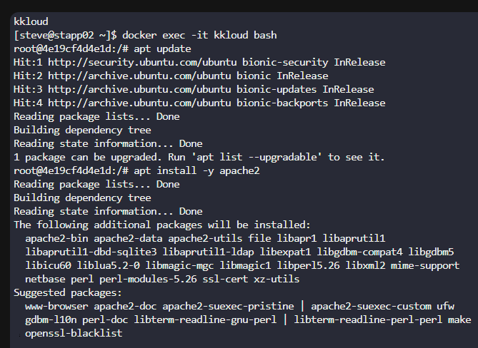

# Day 1 – Linux User Management (KodeKloud)

## Task

Create a user named **ravi** with the login shell set to **/sbin/nologin**.

## Steps / Commands Used

```bash
ssh steve@stapp02
sudo useradd -s /sbin/nologin ravi
```

## Verification

To verify that the user was created with the correct shell:

```bash
cat /etc/passwd | grep ravi
```

Expected output:

```
ravi:x:1001:1001::/home/ravi:/sbin/nologin
```

## Screenshots

### Answer



## Result

The user **ravi** was successfully created with **/sbin/nologin** as the default shell.
